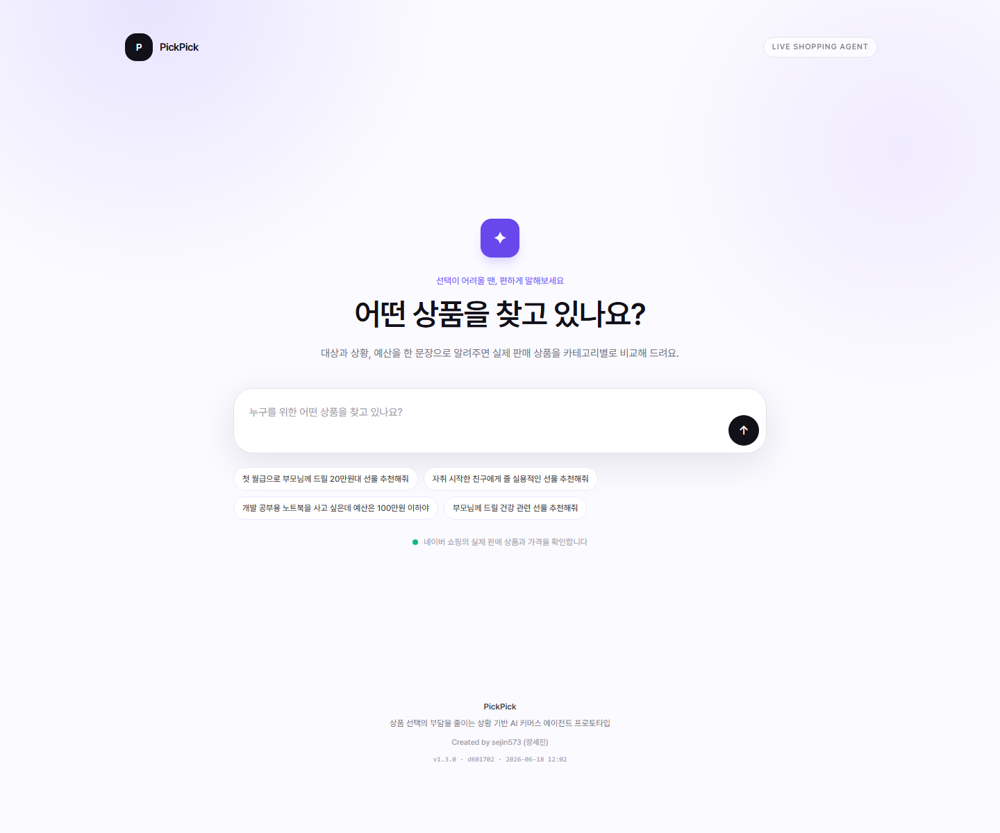
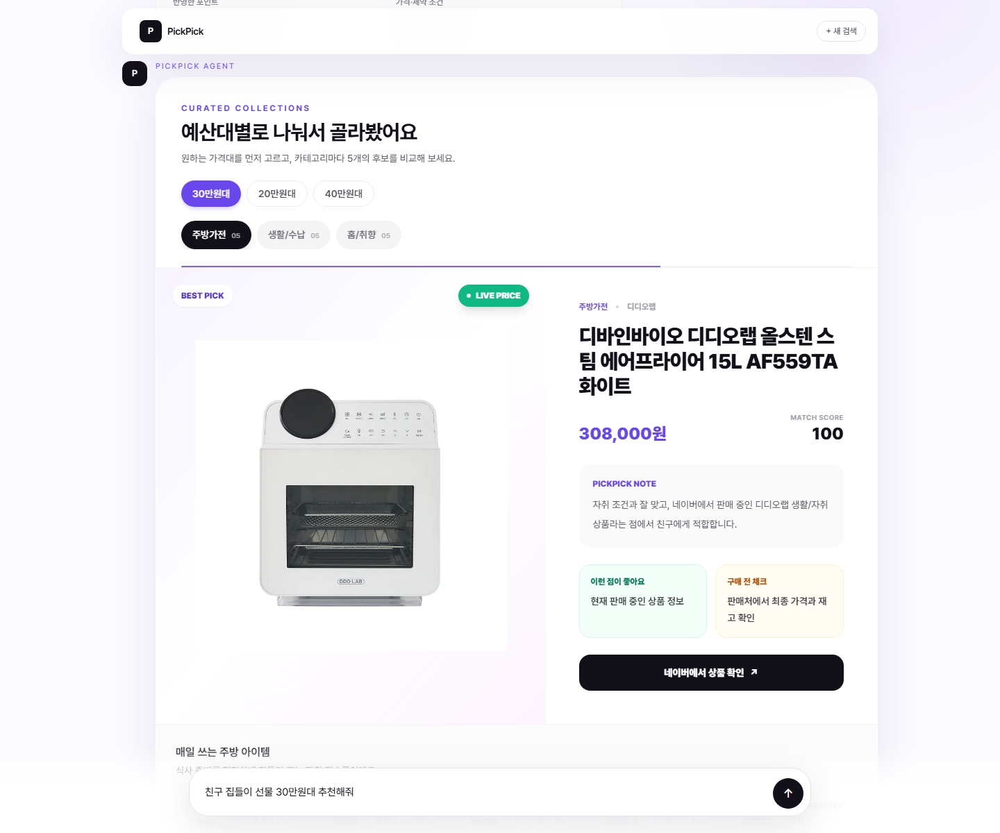
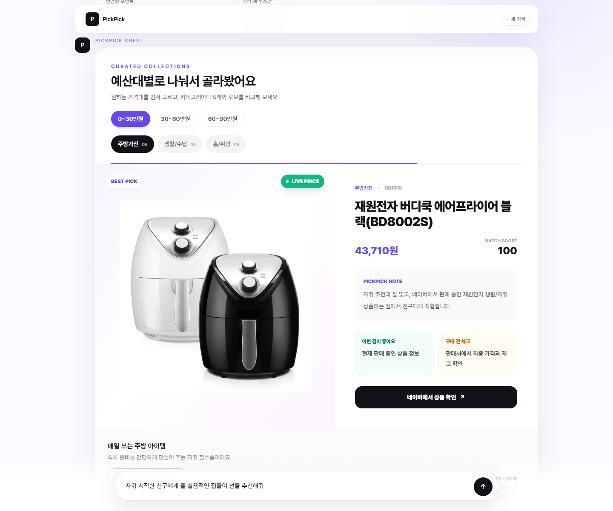

# PickPick

> 자연어 한 문장으로 실제 판매 상품을 비교하고 구매 판단까지 돕는 AI 쇼핑 에이전트

- **배포 URL:** https://pickpick-five.vercel.app
- **GitHub Repository:** https://github.com/sejin573/pickpick
- **테스트 계정:** 로그인 기능 없음 / 접속 후 즉시 사용 가능
- **현재 버전:** v1.5.1

## 제출 정보

| 제출 항목 | 내용 |
| --- | --- |
| 배포 URL | https://pickpick-five.vercel.app |
| GitHub Repository URL | https://github.com/sejin573/pickpick |
| 테스트 계정 | 로그인 기능이 없어 별도 계정이 필요하지 않습니다. |
| README 필수 항목 | 서비스 소개, 문제 정의, 주요 기능, 기술 스택, 실행 방법, 배포 URL, 테스트 계정, LLM/Agent 구조, 데이터 흐름, 중점 구현, 미구현 범위, 개선 방향, AI 도구 활용 여부를 아래에 모두 작성했습니다. |
| 시연 영상 URL | 선택 제출 항목이며, 제출 시 별도 URL을 추가할 수 있습니다. |

## 서비스 화면

### 메인 검색 화면



### 예산을 지정한 추천 결과

친구 집들이 선물을 `30만원대`로 요청한 사례입니다. 요청 가격대를 먼저 보여주고 `20만원대`, `40만원대`를 비교 선택지로 제공합니다.



### 예산을 지정하지 않은 추천 결과

자취를 시작한 친구의 실용적인 집들이 선물을 예산 없이 요청한 사례입니다. `0~30만원`, `30~60만원`, `60~90만원` 범위로 나누어 탐색합니다.



## 1. 서비스명 및 한 줄 소개

**PickPick**은 사용자가 쇼핑 상황을 자연어로 입력하면 대상, 목적, 예산, 취향과 제약조건을 분석하고 실제 판매 상품을 카테고리별로 추천하는 AI 커머스 에이전트입니다.

정형화된 검색 필터를 직접 조작하지 않아도 “자취를 시작한 친구의 실용적인 집들이 선물 추천해줘” 처럼 평소 사용하는 문장만으로 추천을 받을 수 있습니다.

## 2. 문제 정의

온라인 쇼핑에서는 선택지가 많을수록 다음 문제가 커집니다.

- 상품 정보가 너무 많아 구매 결정을 내리기 어렵습니다.
- 가격, 대상, 목적, 취향, 실용성과 감성을 동시에 비교하기 어렵습니다.
- 모호한 상황을 상품 검색어로 직접 바꾸는 과정이 번거롭습니다.
- 검색 결과가 실제 의도와 무관하거나 광고성 상품으로 섞일 수 있습니다.

PickPick은 자연어 입력을 구매 조건과 생활 의도로 구조화하고, 실제 상품을 의미 있는 세 가지 카테고리로 나누어 비교할 수 있게 합니다.

## 3. 주요 기능

### 자연어 쇼핑 요청 분석

- 대상, 상황, 예산, 선호와 제약조건 추출
- 검색 전에 OpenAI가 자유 입력을 실제 구매 가능한 3개 상품 관점과 네이버 검색어로 정리
- OpenAI 쿼리 계획이 실패하면 규칙 기반 키워드 사전과 카테고리 계획으로 자동 복귀
- `30만원대`를 300,000원 이상 400,000원 미만으로 처리
- `100만원 이하`, `10만원대` 등 한국어 예산 표현 지원
- 짧고 모호한 문장의 생활 의도 추론
  - `일하기 싫은데 놀거` → 게임/콘텐츠, 홈/힐링, 야외/활동
  - `피곤해 뭐 없을까` → 마사지/온열, 홈/힐링, 수면
  - `잠이 안 와` → 수면 조명, 침구/편안함, 사운드/공기
  - `사무실 작은 식물` → 소형 식물, 관리 쉬운 식물, 화분/관리

### 실제 판매 상품 검색

- 네이버 쇼핑 검색 API 기반 실제 상품 조회
- 상품 이미지, 현재 최저가, 브랜드, 판매처와 상품 링크 제공
- 렌탈, 중고, 부품, 파티용품 등 노이즈 상품 제외
- 노트북 요청에는 상품명에 노트북·랩탑·맥북이 포함된 결과만 허용
- 네이버 검색 순위, 메이저 쇼핑몰(쿠팡·11번가·지마켓·옥션·위메프·SSG·롯데·네이버 등) 입점, 브랜드 보유 여부를 점수에 반영해 실제로 잘 팔리는 상품이 위로 오게 정렬
- 광범위한 `인기 상품` 검색어 대신 OpenAI가 만든 구체 제품명 검색어만 사용
- 산업용 장비, 교체 부품, 호환 필터, 요청 대상과 다른 아동용·섭취형 상품을 문맥에 따라 제외
- 지나치게 긴 상품명과 검색어 일치도가 낮은 상품을 감점
- 검색 계획 그룹마다 필수 제품 명사 목록을 생성하고, 해당 명사가 없는 상품은 제외
- 같은 가격대의 여러 카테고리에 동일 상품이 반복되지 않도록 우선 분산
- API 오류 또는 키 미설정 시 식물 상품을 포함한 32개 내장 상품 데이터로 자동 복귀

### 카테고리별 추천

- 모든 주요 요청에서 최대 3개 추천 카테고리 구성
- 카테고리마다 상위 상품 3개 제공
- `100만원 이하`처럼 상한 예산을 지정한 일반 요청은 카테고리별 상위 후보를 OpenAI가 재검토해 3개씩 제공
- 예산을 명시하지 않은 요청은 `0~30만원 / 30~60만원 / 60~90만원` 가격대 탭을 추가로 노출하고, 각 가격대 × 카테고리 조합마다 5개의 후보 제공
- `30만원대`처럼 예산 구간을 명시하면 요청 가격대를 첫 탭으로 보여주고, 앞뒤 10만원대(`30만원대 / 20만원대 / 40만원대`)도 비교 선택지로 제공
- 명시 예산의 인접 가격대에서도 카테고리마다 최대 5개의 상품 후보 제공
- 가격대 안에서는 5개 sub-slot으로 가격을 균등하게 분배해 한쪽 가격에 몰리지 않도록 다양성 확보
- 자동 슬라이드와 썸네일 선택으로 상품 이미지·설명 전환
- 추천 점수, 장점, 주의사항과 적합한 사용자 설명
- 조건 분석, 실상품 검색, 품질 검사, OpenAI 비교와 구매 가이드 생성 단계를 어시스턴트 채팅 메시지로 인라인 표시
- 브라우저 탭과 서비스 UI에 PickPick 브랜드 아이콘 적용

### 대화형 인터페이스

- ChatGPT 풍 대화 흐름으로 결과 페이지를 구성: 사용자 입력은 우측 보라색 말풍선, 어시스턴트(P 아바타) 카드가 좌측에서 차례로 등장
- 검색을 시작하면 검색바가 화면 위에서 하단으로 슬라이드 다운하며 도킹, 이후 입력창은 화면 하단에 고정
- 진행 단계가 인라인 채팅 카드로 흘러나오고, 결과 도착 후에도 카드가 사라지지 않고 모든 단계가 ✓로 정리됨
- 분석 패널과 결과 카드들이 stagger 애니메이션으로 부드럽게 순차 등장
- 결과 메시지는 스크롤로 화면에 들어오는 순간 한 장씩 자연스럽게 reveal
- 어시스턴트 채팅 카드는 각 답변 길이에 맞춰 필요한 너비만 사용
- 추천 상품, 비교표, 구매 가이드와 서비스 안내도 `PICKPICK AGENT` 메시지 흐름으로 통일
- 한국어 가독성을 위해 Pretendard 가변 폰트를 사용

### 구매 판단 지원

- 상품 간 가격·목적 적합도·실용성·감성·가성비·리스크 비교
- 가장 추천하는 선택 제시
- 바로 구매해도 좋은 조건
- 한 번 더 고민해야 하는 조건
- 결제 전 추가 확인 사항
- 가격대 추천 카드, 비교표와 구매 가이드가 같은 대표 상품을 기준으로 동기화

### 로그인과 대화 기록

- Supabase Auth의 이메일 Magic Link 로그인
- 로그인 사용자의 자연어 요청과 전체 추천 응답을 PostgreSQL에 자동 저장
- ChatGPT 형태의 좌측 사이드바에서 최근 대화 목록 확인
- 저장된 대화를 선택해 사용자 질문과 추천 결과 전체 복원
- 대화 제목 변경, 삭제와 새 대화 시작
- Row Level Security로 사용자가 본인의 대화와 메시지만 조회·변경
- Supabase 미설정 또는 비로그인 상태에서는 기존 일회성 게스트 추천 유지

## 4. 사용 기술 스택

| 영역 | 기술 |
| --- | --- |
| Frontend | Next.js 15, React 19, TypeScript |
| Styling | Tailwind CSS, Pretendard Variable |
| Backend | Next.js App Router, Route Handler |
| Product Data | Naver Shopping Search API, TypeScript fallback dataset |
| LLM | OpenAI Responses API |
| Database / Auth | Supabase PostgreSQL, Supabase Auth, Row Level Security |
| Deployment | Vercel (GitHub auto-deploy) |
| Version Control | Git, GitHub |

## 5. 실행 방법

Node.js 20 이상을 권장합니다.

```bash
git clone https://github.com/sejin573/pickpick.git
cd pickpick
npm install
npm run dev
```

브라우저에서 `http://localhost:3000`으로 접속합니다.

프로덕션 빌드 확인:

```bash
npm run build
npm run start
```

## 6. 환경 변수

`.env.example`을 복사해 `.env.local` 파일을 생성합니다.

```env
# 실제 네이버 쇼핑 상품 검색
NAVER_CLIENT_ID=
NAVER_CLIENT_SECRET=

# OpenAI Responses API
OPENAI_API_KEY=
OPENAI_MODEL=gpt-5.4-mini

# Supabase 로그인 및 대화 기록
NEXT_PUBLIC_SUPABASE_URL=
NEXT_PUBLIC_SUPABASE_PUBLISHABLE_KEY=
```

모든 API 키는 서버 Route Handler에서만 사용하며 클라이언트 코드에 노출하지 않습니다. 네이버 또는 OpenAI API가 실패해도 fallback agent가 결과를 반환합니다.
공개 API는 요청 본문을 500자로 제한하고 동일 접속자의 단시간 반복 요청을 제한합니다.

### Supabase 설정

1. Supabase 프로젝트를 생성합니다.
2. SQL Editor에서 [`supabase/migrations/202606220001_chat_history.sql`](supabase/migrations/202606220001_chat_history.sql)을 실행합니다.
3. Project URL과 Publishable Key를 `.env.local`과 Vercel 환경 변수에 등록합니다.
4. Supabase Auth의 Site URL을 배포 URL로 설정합니다.
5. Redirect URLs에 로컬 및 배포 콜백을 등록합니다.

```text
http://localhost:3000/auth/confirm
https://pickpick-five.vercel.app/auth/confirm
```

Magic Link는 `/auth/confirm`에서 OTP token hash 또는 PKCE code를 세션으로 교환합니다. 환경 변수가 없으면 로그인 UI 대신 설정 안내가 표시되고 쇼핑 추천은 계속 사용할 수 있습니다.

## 7. 배포 URL

https://pickpick-five.vercel.app

## 8. 테스트 계정 정보

- 로그인 기능 없음
- 별도의 테스트 계정 없음
- 누구나 배포 URL 접속 후 바로 사용 가능

## 9. LLM / Agent 동작 구조

1. **사용자 의도 분석:** 선물, 구매, 휴식, 집중, 수면, 식물/플랜테리어 등 요청 목적을 파악합니다.
2. **조건 추출:** 대상, 예산, 상황, 선호와 제약조건을 구조화합니다.
3. **OpenAI 검색 계획:** 자유 입력을 실제 구매 가능한 세 가지 상품 관점과 네이버 검색어 2~4개씩으로 정리합니다. 제공된 요청에서 벗어난 서비스나 상품군은 만들지 않도록 구조화 출력으로 제한합니다.
4. **규칙 fallback:** OpenAI 키가 없거나 계획 호출이 실패하면 내장 키워드 사전과 카테고리 규칙으로 같은 형식의 검색 계획을 생성합니다.
5. **실상품 검색:** 네이버 쇼핑 API에서 카테고리별 후보를 조회하고 각 결과의 검색 순위를 보존합니다.
6. **품질 필터링:** 가격 범위, 상품명, 카테고리와 제외 키워드를 검사합니다. 식물 요청은 식물·화분·플랜테리어 관련 결과만 통과합니다.
7. **코드 기반 1차 랭킹:** 예산, 키워드 적합도, 실용성, 감성, 가성비, 리스크에 더해 네이버 검색 순위, 메이저 쇼핑몰 입점, 브랜드 보유 여부를 인기·신뢰 신호로 가중합니다.
8. **예산에 따른 분기:**
   - **구간 예산 명시 (`30만원대`):** 요청 가격대를 첫 번째로 두고 앞뒤 10만원 가격대를 함께 구성합니다. `30만원대 / 20만원대 / 40만원대` × 카테고리 3개 그룹마다 최대 5개를 가격 sub-slot으로 분산합니다.
   - **상한·일반 예산 명시 (`100만원 이하`):** 카테고리별 상위 후보 6개를 OpenAI로 보내 사용자 맥락에 가장 적합한 상품 3개를 다시 선정합니다.
   - **예산 미지정:** `0~30만원 / 30~60만원 / 60~90만원` 세 가격대 × 카테고리 3개 = 최대 9개 그룹을 만들고, 각 그룹마다 5개 sub-slot으로 가격을 균등하게 분배해 추천 5개를 구성합니다. 그룹이 많아 OpenAI 재랭킹은 생략합니다.
9. **설명 생성:** 선택 근거와 적합한 사용자를 실제 후보 정보에 근거해 작성합니다.
10. **구매 가이드 생성:** 비교 결과와 구매 전 확인 사항을 제공합니다.

가격 범위, 상품 유형, 링크 유효성과 노이즈 제거는 항상 코드가 담당합니다. OpenAI는 안전한 실제 후보군 안에서 최종 상품을 재선정하며, 제공되지 않은 상품을 생성하거나 가격·링크를 변경할 수 없습니다. 호출 실패 시 코드 기반 결과로 자동 복귀합니다.

OpenAI 재랭킹을 사용하는 요청에서도 토큰 사용량을 줄이기 위해 네이버 원본 결과 전체를 전송하지 않습니다. 코드가 각 카테고리 후보를 상위 6개로 압축하고 이름, 가격, 브랜드, 핵심 장단점만 한 번의 OpenAI 요청으로 전달합니다. 낮은 reasoning effort와 짧은 출력 형식, 최대 출력 토큰 제한을 적용했습니다.

## 10. 데이터 흐름

```text
사용자 자연어 입력
  → POST /api/recommend
  → 의도·예산·대상·상황 분석
  → OpenAI가 구매 가능한 카테고리 3개와 검색어 계획
    ↳ 실패 시 규칙 기반 카테고리·검색어 계획
  → 네이버 쇼핑 API 병렬 검색 (검색 순위 보존)
  → 가격·상품 유형·노이즈 필터
  → 카테고리별 코드 기반 1차 점수 계산 (인기·메이저몰·브랜드 가중)
  → [30만원대 등 구간 예산] 요청 가격대 → 아래 10만원대 → 위 10만원대 순서
                           · 각 가격대 × 카테고리 그룹마다 최대 5개
                           · 5개 sub-slot으로 가격 분산
  → [100만원 이하 등 일반 예산] 카테고리별 후보 6개 압축 → OpenAI가 최종 3개 재선정
  → [예산 미지정] 0~30 / 30~60 / 60~90만원 × 카테고리 9개 그룹 구성
                  · 각 그룹마다 5개 sub-slot으로 가격 균등 분배
                  · 그룹별 5개 추천 (OpenAI 재랭킹 생략)
  → 추천 카드·비교표·구매 가이드를 동일 대표 상품 기준으로 동기화
  → 스크롤 진입 시 어시스턴트 메시지를 한 장씩 reveal
```

API 요청 예시:

```json
{
  "message": "친구 집들이 선물 30만원대 추천해줘"
}
```

주요 응답 필드:

- `analysis`
- `agentSteps`
- `recommendations`
- `recommendationGroups`
- `priceBands` (구간 예산 또는 예산 미지정 요청의 가격대 탭 메타)
- `comparison`
- `buyingGuide`
- `meta`

## 11. 본인이 중점적으로 구현한 부분

- API 키 또는 외부 API 장애에도 화면이 유지되는 fallback agent
- 한국어 예산 표현을 실제 가격 범위로 변환하는 로직
- 모호한 문장을 생활 의도로 변환하는 규칙 기반 intent engine
- OpenAI 구조화 출력을 이용한 사전 카테고리·검색어 계획과 규칙 fallback
- `사무실 작은 식물` 같은 자유 입력을 소형 식물·관리 쉬운 식물·화분/관리 검색으로 연결하는 식물 도메인 처리
- 요청마다 세 가지 카테고리를 계획하는 추천 구조
- 예산 미지정 요청을 위한 `0~30 / 30~60 / 60~90만원` 가격대 브라우징과 sub-slot 가격 분배
- 구간 예산 요청에서 요청 가격대를 먼저 노출하고 앞뒤 10만원 범위를 함께 비교하는 인접 가격대 탐색
- 가격대 × 카테고리마다 최대 5개 상품을 제공하고 가격이 한쪽에 몰리지 않게 분산하는 로직
- 네이버 검색 순위, 메이저 쇼핑몰 입점, 브랜드 보유 여부를 인기·신뢰 신호로 반영하는 점수 가중
- 네이버 검색 결과의 상품 유형·가격·노이즈 검증
- 상품이 자동 전환되는 카테고리 탭·슬라이드 UI
- ChatGPT 풍 대화형 결과 페이지: 사용자 말풍선, 모든 결과의 `PICKPICK AGENT` 메시지 래핑, 검색바 하단 슬라이드 다운 도킹
- Intersection Observer 기반으로 스크롤 진입 시 결과 메시지가 한 장씩 등장하는 reveal 모션
- 한국어 가독성을 위한 Pretendard Variable 폰트 적용과 타이포그래피 톤다운
- 라이브 배포를 즉시 확인할 수 있도록 푸터에 빌드 버전·커밋 SHA·빌드 시각을 표기
- 추천 근거를 확인할 수 있는 접이식 Agent Report
- 서버 전용 자격증명과 클라이언트 UI의 명확한 분리
- 이전 요청 취소와 응답 순서 검증으로 느린 응답이 최신 결과를 덮어쓰지 않도록 처리
- 카테고리별 상품 중복 제거, 서버 오류 로그와 공개 API 요청 보호
- Supabase 이메일 Magic Link 로그인과 쿠키 기반 세션
- 사용자별 대화·메시지 저장 API와 본인 데이터만 허용하는 RLS
- ChatGPT형 대화 사이드바, 대화 복원·제목 변경·삭제
- GitHub push만으로 Vercel 자동 배포가 동작하는 구성

## 12. 구현하지 못한 부분

- 쿠팡 파트너스 상품 검색 및 제휴 딥링크 API
- 여러 쇼핑몰의 동일 상품 실시간 가격 비교
- 실제 구매 후기 수집과 리뷰 신뢰도 분석
- 즐겨찾기와 여러 추천을 하나의 대화에서 이어가는 다중 턴 메시지
- 재고와 배송 예정일의 실시간 검증
- 결제 또는 장바구니 연동
- 검색 계획과 최종 추천 재랭킹을 하나의 Agent 호출로 통합하는 최적화

## 13. 향후 개선 방향

Supabase 기반 로그인과 대화 영구 저장을 구현했으며, 다음 단계에서는 저장된 기록을 실제 추천 품질에 활용할 계획입니다.

- 하나의 대화에서 후속 질문과 재추천을 이어가는 다중 턴 구조
- 저장된 관심사와 선택 이력을 다음 추천에 반영하는 개인화
- 로그인과 연동한 상품 즐겨찾기
- 대화 검색, 보관 처리와 사용자별 데이터 보존 기간 설정
- 추천 클릭·구매 전환 데이터를 활용한 추천 품질 개선

현재는 로그인한 사용자의 요청과 추천 결과를 저장하며, 비로그인 사용자의 대화는 서버에 영구 저장하지 않습니다.

## 14. AI 개발 도구 활용 여부

Codex를 활용해 초기 프로젝트 구조, UI 컴포넌트, 추천 로직 초안, API 연동 구조와 README 초안을 생성했습니다. 생성된 코드는 직접 실행하고 검토했으며, 실제 네이버 상품 결과와 사용자 입력 사례를 반복 테스트하면서 필터링, 가격 범위, 추천 카테고리와 UI를 수정했습니다.

AI가 생성한 결과를 그대로 제출하지 않고 다음 검증 과정을 수행했습니다.

- TypeScript 프로덕션 빌드 확인
- ESLint 검사
- 대표 요청별 필수·금지 상품어를 검사하는 `npm run evaluate:quality`
- 실제 Vercel 배포
- 운영 URL의 API 응답 확인
- 모호한 입력과 명시적 상품 입력 테스트
- 실제 운영 화면 캡처
- 예산 지정·미지정 화면을 분리한 README 자동 캡처 스크립트 실행

## 15. Vercel 배포 방법

1. GitHub에 저장소를 생성하고 코드를 push합니다.
2. Vercel에서 **Add New Project**를 선택합니다.
3. GitHub 저장소를 Import합니다.
4. Framework Preset이 **Next.js**인지 확인합니다.
5. Environment Variables에 필요한 키를 등록합니다.
6. **Deploy**를 선택합니다.
7. 환경변수 변경 후에는 최신 배포를 Redeploy합니다.

환경변수가 없어도 내장 상품 데이터와 fallback agent로 기본 서비스가 동작합니다.

## 16. 프로젝트 구조

```text
app/
  api/conversations/       # 사용자별 대화 저장·목록·복원·수정·삭제
  api/recommend/route.ts   # 추천 API (인접 가격대 / 예산 미지정 가격대 그룹 구성)
  auth/confirm/route.ts    # Magic Link / PKCE 인증 콜백
  globals.css              # scroll-reveal, composer-dock-in 등 트랜지션
  layout.tsx               # Pretendard 폰트 로드
  page.tsx                 # 채팅 흐름, 요청 취소, Intersection Observer, 푸터 버전
components/
  AssistantMessage.tsx     # 결과 영역 공통 P 아바타 + PICKPICK AGENT 래퍼
  AuthDialog.tsx           # 이메일 Magic Link 로그인
  ChatSidebar.tsx          # 최근 대화 목록, 복원, 제목 변경과 삭제
  Hero.tsx                 # 첫 화면 + compact 모드의 하단 도킹 검색바
  ChatProgress.tsx         # 어시스턴트 진행 단계 인라인 메시지
  AnalysisPanel.tsx        # 어시스턴트 응답 카드 톤의 요청 정리
  RecommendationCards.tsx  # 가격대 탭 + 카테고리 탭 + 슬라이드
  ComparisonTable.tsx
  BuyingGuide.tsx
  AgentSteps.tsx
  PromptExamples.tsx
  ServiceInfo.tsx
lib/
  agent.ts                 # 의도 분석, 점수 계산, LLM 보완, 가격 분배
  query-planner.ts         # OpenAI 기반 카테고리·검색어 사전 계획 + 규칙 복귀
  product-provider.ts      # 네이버 실상품 검색, 품질 필터, 검색 순위 보존
  products.ts              # fallback 상품 데이터
  types.ts                 # Product / PriceBand / RecommendationGroup 등
  supabase/                # 브라우저·서버 클라이언트와 세션 유틸리티
docs/images/               # 실제 서비스 화면 캡처
scripts/
  capture-readme.mjs       # 운영 URL의 예산 지정·미지정 README 화면 자동 캡처
supabase/migrations/
  202606220001_chat_history.sql # conversations/messages/RLS 스키마
middleware.ts              # Supabase 인증 쿠키 갱신
```

## 17. 선택 제출: 시연 영상

3분 이내 시연 영상은 선택 제출 항목입니다. 영상 제출 시 아래 형식으로 URL을 추가합니다.

```text
시연 영상 URL: 제출 시 입력
```

권장 시연 흐름은 자연어 입력 → 요청 분석 → 가격대 선택 → 카테고리 전환 → 5개 상품 비교 → Agent Report → 비교표와 구매 가이드 확인 순서입니다.

## 제출 전 체크리스트

- [x] `npm install`
- [x] `npm run dev`
- [x] `npm run build`
- [x] GitHub Repository 생성 및 push
- [x] Vercel 배포
- [x] 네이버 쇼핑 API 환경변수 설정
- [x] README 배포 URL 작성
- [x] 실제 서비스 화면 첨부
- [x] 예산 지정·미지정 화면을 구분한 최신 스크린샷 첨부
- [x] README 필수 13개 항목 작성
- [ ] 선택 제출: 3분 이내 시연 영상 URL
- [ ] 과제 제출 페이지에 배포 URL과 GitHub URL 제출
