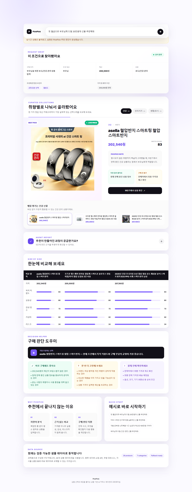

# PickPick

> 자연어 한 문장으로 실제 판매 상품을 비교하고 구매 판단까지 돕는 AI 쇼핑 에이전트

- **배포 URL:** https://pickpick-five.vercel.app
- **GitHub Repository:** https://github.com/sejin573/pickpick
- **테스트 계정:** 로그인 기능 없음 / 접속 후 즉시 사용 가능

## 서비스 화면

### 메인 검색 화면


### 실제 상품 추천 결과



## 1. 서비스명 및 한 줄 소개

**PickPick**은 사용자가 쇼핑 상황을 자연어로 입력하면 대상, 목적, 예산, 취향과 제약조건을 분석하고 실제 판매 상품을 카테고리별로 추천하는 AI 커머스 에이전트입니다.

정형화된 검색 필터를 직접 조작하지 않아도 “첫 월급으로 부모님께 드릴 20만원대 선물 추천해줘”, “피곤한데 뭐 없을까”처럼 평소 사용하는 문장만으로 추천을 받을 수 있습니다.

## 2. 문제 정의

온라인 쇼핑에서는 선택지가 많을수록 다음 문제가 커집니다.

- 상품 정보가 너무 많아 구매 결정을 내리기 어렵습니다.
- 가격, 대상, 목적, 취향, 실용성과 감성을 동시에 비교하기 어렵습니다.
- 모호한 상황을 상품 검색어로 직접 바꾸는 과정이 번거롭습니다.
- 검색 결과가 실제 의도와 무관하거나 광고성 상품으로 섞일 수 있습니다.

PickPick은 자연어 입력을 구매 조건과 생활 의도로 구조화하고, 실제 상품을 의미 있는 세 가지 카테고리로 나누어 비교할 수 있게 합니다.

## 3. 주요 기능

### 자연어 쇼핑 요청 분석

- 대상, 상황, 예산, 선호와 제약조건 추출
- `30만원대`를 300,000원 이상 400,000원 미만으로 처리
- `100만원 이하`, `10만원대` 등 한국어 예산 표현 지원
- 짧고 모호한 문장의 생활 의도 추론
  - `일하기 싫은데 놀거` → 게임/콘텐츠, 홈/힐링, 야외/활동
  - `피곤해 뭐 없을까` → 마사지/온열, 홈/힐링, 수면
  - `잠이 안 와` → 수면 조명, 침구/편안함, 사운드/공기

### 실제 판매 상품 검색

- 네이버 쇼핑 검색 API 기반 실제 상품 조회
- 상품 이미지, 현재 최저가, 브랜드, 판매처와 상품 링크 제공
- 렌탈, 중고, 부품, 파티용품 등 노이즈 상품 제외
- 노트북 요청에는 상품명에 노트북·랩탑·맥북이 포함된 결과만 허용
- API 오류 또는 키 미설정 시 28개 내장 상품 데이터로 자동 복귀

### 카테고리별 추천

- 모든 주요 요청에서 최대 3개 추천 카테고리 구성
- 카테고리마다 상위 상품 3개 제공
- 자동 슬라이드와 썸네일 선택으로 상품 이미지·설명 전환
- 추천 점수, 장점, 주의사항과 적합한 사용자 설명

### 구매 판단 지원

- 상품 간 가격·목적 적합도·실용성·감성·가성비·리스크 비교
- 가장 추천하는 선택 제시
- 바로 구매해도 좋은 조건
- 한 번 더 고민해야 하는 조건
- 결제 전 추가 확인 사항

## 4. 사용 기술 스택

| 영역 | 기술 |
| --- | --- |
| Frontend | Next.js 15, React 19, TypeScript |
| Styling | Tailwind CSS |
| Backend | Next.js App Router, Route Handler |
| Product Data | Naver Shopping Search API, TypeScript fallback dataset |
| LLM | OpenAI Responses API 또는 Ollama Chat API |
| Deployment | Vercel |
| Version Control | Git, GitHub |

## 5. 실행 방법

Node.js 20 이상을 권장합니다.

```bash
git clone https://github.com/sejin573/pickpick.git
cd pickpick
npm install
npm run dev
```

브라우저에서 `http://localhost:3000`으로 접속합니다.

프로덕션 빌드 확인:

```bash
npm run build
npm run start
```

## 6. 환경 변수

`.env.example`을 복사해 `.env.local` 파일을 생성합니다.

```env
# 실제 네이버 쇼핑 상품 검색
NAVER_CLIENT_ID=
NAVER_CLIENT_SECRET=

# LLM 공급자: openai | ollama
LLM_PROVIDER=openai
OPENAI_API_KEY=

# Ollama 사용 시
OLLAMA_BASE_URL=http://127.0.0.1:11434
OLLAMA_MODEL=qwen3:4b
OLLAMA_API_KEY=
```

모든 API 키는 서버 Route Handler에서만 사용하며 클라이언트 코드에 노출하지 않습니다. 네이버 또는 LLM API가 실패해도 fallback agent가 결과를 반환합니다.

Ollama의 로컬 주소는 Vercel에서 접근할 수 없으므로 배포 환경에서는 Ollama Cloud 또는 외부에서 접근 가능한 Ollama 서버가 필요합니다.

## 7. 배포 URL

https://pickpick-five.vercel.app

## 8. 테스트 계정 정보

- 로그인 기능 없음
- 별도의 테스트 계정 없음
- 누구나 배포 URL 접속 후 바로 사용 가능

## 9. LLM / Agent 동작 구조

1. **사용자 의도 분석:** 선물, 구매, 휴식, 집중, 수면 등 요청 목적을 파악합니다.
2. **조건 추출:** 대상, 예산, 상황, 선호와 제약조건을 구조화합니다.
3. **카테고리 계획:** 요청을 세 가지 상품 관점으로 분리합니다.
4. **실상품 검색:** 네이버 쇼핑 API에서 카테고리별 후보를 조회합니다.
5. **품질 필터링:** 가격 범위, 상품명, 카테고리와 제외 키워드를 검사합니다.
6. **추천 점수 계산:** 예산, 키워드 적합도, 실용성, 감성, 가성비와 리스크를 계산합니다.
7. **설명 생성:** 규칙 기반 설명을 생성하고, 설정된 경우 LLM이 문장을 자연스럽게 보완합니다.
8. **구매 가이드 생성:** 비교 결과와 구매 전 확인 사항을 제공합니다.

상품 선택과 점수 계산은 코드 기반으로 먼저 수행합니다. LLM은 상품명, 가격, 순위와 링크를 변경하지 않고 설명 문구만 보완합니다. 화면의 Agent Report는 실제 chain-of-thought가 아닌 사용자에게 공개 가능한 판단 단계 요약입니다.

## 10. 데이터 흐름

```text
사용자 자연어 입력
  → POST /api/recommend
  → 의도·예산·대상·상황 분석
  → 추천 카테고리 3개 계획
  → 네이버 쇼핑 API 병렬 검색
  → 가격·상품 유형·노이즈 필터
  → 카테고리별 추천 점수 계산
  → 카테고리별 상위 상품 3개 선정
  → OpenAI/Ollama 설명 보완(선택)
  → 분석·상품 슬라이드·비교·구매 가이드 UI
```

API 요청 예시:

```json
{
  "message": "첫 월급으로 부모님께 드릴 20만원대 선물 추천해줘"
}
```

주요 응답 필드:

- `analysis`
- `agentSteps`
- `recommendations`
- `recommendationGroups`
- `comparison`
- `buyingGuide`
- `meta`

## 11. 본인이 중점적으로 구현한 부분

- API 키 또는 외부 API 장애에도 화면이 유지되는 fallback agent
- 한국어 예산 표현을 실제 가격 범위로 변환하는 로직
- 모호한 문장을 생활 의도로 변환하는 규칙 기반 intent engine
- 요청마다 세 가지 카테고리를 계획하는 추천 구조
- 네이버 검색 결과의 상품 유형·가격·노이즈 검증
- 상품이 자동 전환되는 카테고리 탭·슬라이드 UI
- 추천 근거를 확인할 수 있는 접이식 Agent Report
- 서버 전용 자격증명과 클라이언트 UI의 명확한 분리
- GitHub 및 Vercel에 실제 배포 가능한 구성

## 12. 구현하지 못한 부분

- 쿠팡 파트너스 상품 검색 및 제휴 딥링크 API
- 여러 쇼핑몰의 동일 상품 실시간 가격 비교
- 실제 구매 후기 수집과 리뷰 신뢰도 분석
- 로그인, 즐겨찾기와 사용자별 추천 기록
- 재고와 배송 예정일의 실시간 검증
- 결제 또는 장바구니 연동

## 13. 향후 개선 방향

- 쿠팡 파트너스 및 추가 커머스 공급자 연동
- 리뷰 요약과 장단점 근거 표시
- 임베딩 기반 의미 검색과 카테고리 계획 개선
- 사용자 피드백을 반영한 개인화 추천
- 추천 클릭·구매 전환 데이터 기반 A/B 테스트
- 가격 변동 및 품절 상품 자동 제외
- 검색 결과 다양성과 판매처 신뢰도 점수 도입

## 14. AI 개발 도구 활용 여부

Codex를 활용해 초기 프로젝트 구조, UI 컴포넌트, 추천 로직 초안, API 연동 구조와 README 초안을 생성했습니다. 생성된 코드는 직접 실행하고 검토했으며, 실제 네이버 상품 결과와 사용자 입력 사례를 반복 테스트하면서 필터링, 가격 범위, 추천 카테고리와 UI를 수정했습니다.

AI가 생성한 결과를 그대로 제출하지 않고 다음 검증 과정을 수행했습니다.

- TypeScript 프로덕션 빌드 확인
- ESLint 검사
- 실제 Vercel 배포
- 운영 URL의 API 응답 확인
- 모호한 입력과 명시적 상품 입력 테스트
- 실제 운영 화면 캡처

## 15. Vercel 배포 방법

1. GitHub에 저장소를 생성하고 코드를 push합니다.
2. Vercel에서 **Add New Project**를 선택합니다.
3. GitHub 저장소를 Import합니다.
4. Framework Preset이 **Next.js**인지 확인합니다.
5. Environment Variables에 필요한 키를 등록합니다.
6. **Deploy**를 선택합니다.
7. 환경변수 변경 후에는 최신 배포를 Redeploy합니다.

환경변수가 없어도 내장 상품 데이터와 fallback agent로 기본 서비스가 동작합니다.

## 16. 프로젝트 구조

```text
app/
  api/recommend/route.ts   # 추천 API
  globals.css
  layout.tsx
  page.tsx
components/
  Hero.tsx
  AnalysisPanel.tsx
  RecommendationCards.tsx
  ComparisonTable.tsx
  BuyingGuide.tsx
  AgentSteps.tsx
lib/
  agent.ts                 # 의도 분석, 점수 계산, LLM 보완
  product-provider.ts      # 네이버 실상품 검색 및 품질 필터
  products.ts              # fallback 상품 데이터
  types.ts
docs/images/               # 실제 서비스 화면 캡처
```

## 제출 전 체크리스트

- [x] `npm install`
- [x] `npm run dev`
- [x] `npm run build`
- [x] GitHub Repository 생성 및 push
- [x] Vercel 배포
- [x] 네이버 쇼핑 API 환경변수 설정
- [x] README 배포 URL 작성
- [x] 실제 서비스 화면 첨부
- [ ] 과제 제출 페이지에 배포 URL과 GitHub URL 제출
